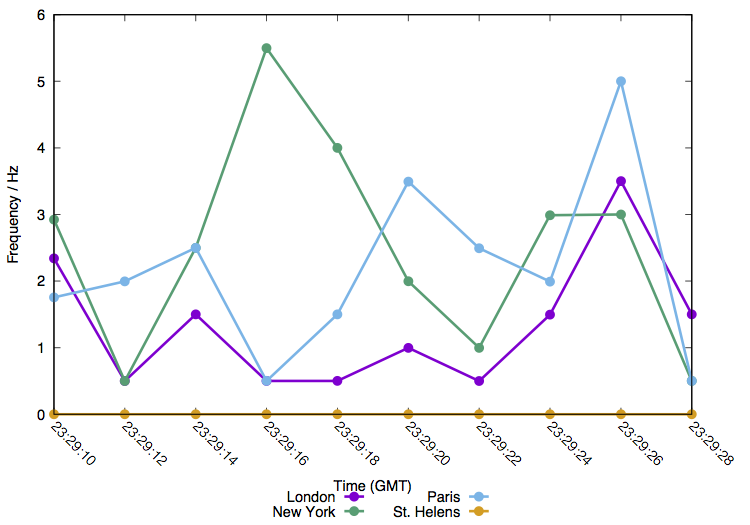

# TwitterTrack

A simple example interface into Twitter's stream API.

Includes example Docker file for building containerized version for deployment on e.g. Amazon Web Services.

## Requirements

Mandatory:

* Node.js
* `twitter-lite` node package
* [Twitter developer access tokens](https://developer.twitter.com/en/docs/basics/authentication/guides/access-tokens.html), accessible as environment variables

Optional:

* [gnuplot](www.gnuplot.info) (for easy plotting of example output data)

## Platform compatibility

In principle, anything that supports Node.js!

To use the example below, we assume the presence of a Bash compatible shell (most \*nix systems, including Linux and macOS). To produce the graphical output shown, gnuplot is required.

## Example usage

The `twitter_test.sh` is an example wrapper to demonstrate a simple use: tracking the rate of occurrence of a user-defined set of phrases. This script assumes the presence of a `sensitive.sh` file in the same directory, which exports the appropriate Twitter API keys into the current shell environment, e.g.:

	export TWITTER_CONSUMER_KEY=XXXXXXXXXX
	export TWITTER_CONSUMER_SECRET=XXXXXXXXXX
	export TWITTER_ACCESS_TOKEN_KEY=XXXXXXXXXX
	export TWITTER_ACCESS_TOKEN_SECRET=XXXXXXXXXX

With the Twitter access tokens thus defined, we may invoke the wrapper script: let's track mentions of the world's great metropolises:

	./twitter_test.sh London "New York" Paris "St. Helens"

My testing produced the following output on `stdout`:

	    Time:D/M/Y:GMT          interval/s              missed            "London"          "New York"             "Paris"        "St. Helens"
	11/5/2018 23:29:10                1.71                   0                   4                   5                   3                   0
	11/5/2018 23:29:12               2.004                   0                   1                   1                   4                   0
	11/5/2018 23:29:14               2.001                   0                   3                   5                   5                   0
	11/5/2018 23:29:16               2.001                   0                   1                  11                   1                   0
	11/5/2018 23:29:18                   2                   0                   1                   8                   3                   0
	11/5/2018 23:29:20               2.003                   0                   2                   4                   7                   0
	11/5/2018 23:29:22               2.005                   0                   1                   2                   5                   0
	11/5/2018 23:29:24               2.007                   0                   3                   6                   4                   0
	11/5/2018 23:29:26                   2                   0                   7                   6                  10                   0
	11/5/2018 23:29:28               2.001                   0                   3                   1                   1                   0

Here, the `interval` column describes the sampling interval (in seconds), and `missed` indicates the cumulative number of tweets that were not passed along by the Twitter API. The latter is typically due to Twitter's rate limiting system enforcing a sample of only around 1% of the total Twitter traffic being passed along by the standard stream API.

If you have `gnuplot` installed, the outout of `twitter_test.sh` can be turned into a graph like so:

	gnuplot plot_output.gscr

Producing an encapsulated PostScript file:

## Notes

* Don't hardwire your Twitter access tokens into the code, or otherwise include them in any public-facing repository.
* Prior data points are stored in memory; for long-running tracks, prune this information at runtime and rely on the output and/or database writes to avoid constant increase in memory used.

Happy tracking!
